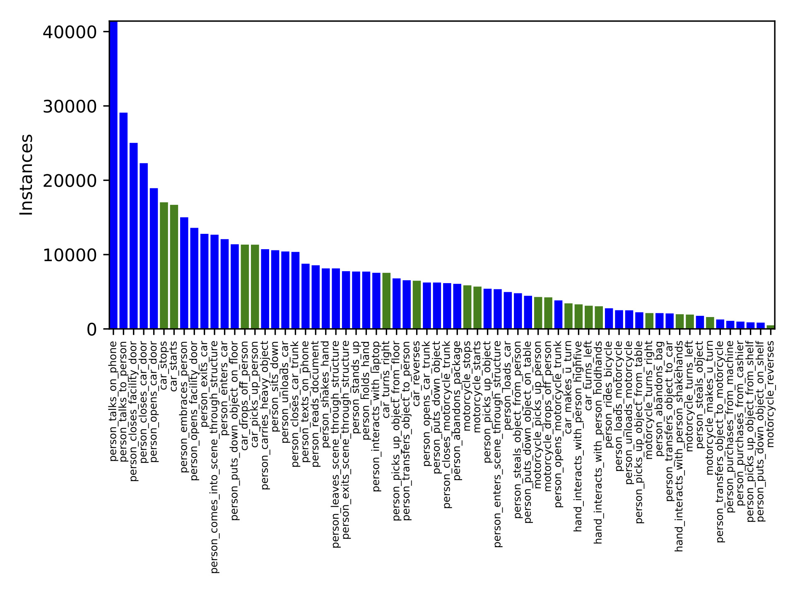

<a href="https://github.com/visym/collector" class="github-corner" aria-label="View source on GitHub"><svg width="80" height="80" viewBox="0 0 250 250" style="fill:#151513; color:#fff; position: absolute; top: 0; border: 0; right: 0;" aria-hidden="true"><path d="M0,0 L115,115 L130,115 L142,142 L250,250 L250,0 Z"></path><path d="M128.3,109.0 C113.8,99.7 119.0,89.6 119.0,89.6 C122.0,82.7 120.5,78.6 120.5,78.6 C119.2,72.0 123.4,76.3 123.4,76.3 C127.3,80.9 125.5,87.3 125.5,87.3 C122.9,97.6 130.6,101.9 134.4,103.2" fill="currentColor" style="transform-origin: 130px 106px;" class="octo-arm"></path><path d="M115.0,115.0 C114.9,115.1 118.7,116.5 119.8,115.4 L133.7,101.6 C136.9,99.2 139.9,98.4 142.2,98.6 C133.8,88.0 127.5,74.4 143.8,58.0 C148.5,53.4 154.0,51.2 159.7,51.0 C160.3,49.4 163.2,43.6 171.4,40.1 C171.4,40.1 176.1,42.5 178.8,56.2 C183.1,58.6 187.2,61.8 190.9,65.4 C194.5,69.0 197.7,73.2 200.1,77.6 C213.8,80.2 216.3,84.9 216.3,84.9 C212.7,93.1 206.9,96.0 205.4,96.6 C205.1,102.4 203.0,107.8 198.3,112.5 C181.9,128.9 168.3,122.5 157.7,114.1 C157.9,116.9 156.7,120.9 152.7,124.9 L141.0,136.5 C139.8,137.7 141.6,141.9 141.8,141.8 Z" fill="currentColor" class="octo-body"></path></svg></a>

# People in Public - 250k - Stabilized


# Overview

The People in Public dataset is a consented large scale video dataset of people doing things in public places.  Our team has pioneered the use of a 
custom designed mobile app that combines video collection, activity labeling and bounding box annotation into a single step.  Our goal is to 
make collecting annotated video datasets as easily and cheaply as recording a video.  Currently, we are collecting a dataset of the MEVA 
classes (http://mevadata.org).  This package provides a release of this dataset, containing 314,6332 annotated activity instances collected by 
over 150 subjects in 44 countries around the world. 

This dataset contains 314,332 stabilized video clips of 66 classes of activities performed by people in public places.  The activity labels are subsets of the 37 activities in the [Multiview Extended Video with Activities (MEVA)](https://mevadata.org) dataset and is consistent with the [Activities in Extended Video (ActEV)](https://actev.nist.gov/) challenge.  

[Background stabilization](https://github.com/visym/vipy/blob/bc20f6f32492badd181faa0ccf7b0029f1f63fee/vipy/flow.py#L307-L328) was performed using an affine coarse to fine optical-flow method, followed by [actor bounding box stabilization](https://github.com/visym/collector/blob/adc5486c7f88291b77f9a707a78763c2b5958406/pycollector/detection.py#L177-L236).  Stabilization is designed to minimize distortion for small motions in the region near the center of the actor box.  Remaining stabilization artifacts are due to non-planar scene structure, rolling shutter distortion, and sub-pixel optical flow correspondence errors.  Stabilization artifacts manifest as a subtly shifting background relative to the actor which may affect optical flow based methods.  All stabilizations can be filtered using the provided stabilization residual which measures the quality of the stabilization.  

## Download

* [pip_250k_stabilized.tar.gz (165.41 GB)](https://dl.dropboxusercontent.com/s/4j46tp640106dg9/pip_250k_stabilized.tar.gz?dl=0)&nbsp;&nbsp;MD5:7b0fe316c8e6239753a6e29b801284f2&nbsp;&nbsp;Updated:08Mar21
    * Full release, includes all of pip-175k-stabilized.
* [pip_250k_stabilized_annotations.tar.gz (0.94 GB)](https://dl.dropboxusercontent.com/s/boegvyts3kvgw8i/pip_250k_stabilized_annotations.tar.gz)&nbsp;&nbsp;MD5:d4ec1bde157f90689ee3ac9910bef25e&nbsp;&nbsp;Updated:08Mar21
    * Release of video annotations only
    * [Visualization of one instance per class](https://htmlpreview.github.io/?https://dl.dropboxusercontent.com/s/5dtd2rpk3sxhc9y/pip_250k_stabilized_annotations_sampler.html) shown as a quicklook montage of nine annotated frames from the clip, organized row-wise.
* [pip_250k_stabilized_nomevapad_annotations.tar.gz (0.94 GB)](https://dl.dropboxusercontent.com/s/2n3nhtcpn1542ir/pip_250k_stabilized_nomevapad_annotations.tar.gz)&nbsp;&nbsp;MD5:c2a7cd41c9f051980643bac558b8d3c0&nbsp;&nbsp;Updated:08Mar21
    * Release of video annotations only, without applying the temporal padding specified in the [MEVA annotation definition](https://gitlab.kitware.com/meva/meva-data-repo/blob/master/documents/MEVA-Annotation-Definitions.pdf).
    * [Visualization of one instance per class](https://htmlpreview.github.io/?https://dl.dropboxusercontent.com/s/otyen3t96sj8b13/pip_250k_stabilized_nomevapad_annotations_sampler.html) shown as a quicklook montage of nine annotated frames from the clip, organized row-wise.


## Quickstart

See [pip-175k](https://visym.github.io/collector/pip_175k/).

To extract the smallest square video crop containing the stabilized track for a vipy.video.Scene() object v:

```python
import vipy
v = vipy.util.load('/path/to/stabilized.json')[0]   # load videos and take one 
vs = v.crop(v.trackbox(dilate=1.0).maxsquare()).resize(224,224).saveas('/path/to/out.mp4')
vs.getattribute('stabilize')   # returns a stabilization residual (bigger is worse)
```


## Best Practices

[Notebook demo](https://htmlpreview.github.io/?https://github.com/visym/collector/blob/master/docs/pip_175k/best_practices.html)&nbsp;[[html]](https://htmlpreview.github.io/?https://github.com/visym/collector/blob/master/docs/pip_175k/best_practices.html)[[ipynb]](https://github.com/visym/collector/blob/master/docs/pip_175k/best_practices.ipynb) showing best practices for using the PIP-175k dataset for training.

# Class Distribution



* The category mapping from [PIP to MEVA](pip_to_meva.txt) is available for training.
 
# Errata

* The classes "person_leaves_scene_through_structure" and "person_exits_scene_through_structure" are synonymous and should be merged.  
* The classes "person_comes_into_scene_through_structure" and "person_enters_scene_through_structure" are synonymous and should be merged.
* The classes "hand_interacts_with_person_holdhands" and "person_holds_hand" are synonymous and should be merged.
* The classes "hand_interacts_with_person_shakehands" and "person_shakes_hand" are synonymous and should be merged.
* A small number of videos exhibit a face detector false alarm which looks like a large pixelated circle which lasts a single frame.  This is the in-app face blurring incorrectly redacting the background.  You can filter these videos by removing videos v with 

```python
videolist = [v for v in videolist if not v.getattribute('blurred faces') > 0]
```

* A small number of videos exhibit stabilization that does not include enough padding, so that the tracked bounding box falls within the black border or falls outside the image rectangle completely.  This typically occurs with videos with large motions, such as vehicle turning classes.  These videos can be filtered to remove degenerate tracks or tracks without any bounding boxes that intersects the image rectangle using the following.  (Note that this may take a while since the encodings must be first unpacked from an internal JSON representation used to simplify reference cycle garbage collection, and each video must be touched to extract the frame dimensions)

```python
videolist = [v for v in videolist if v.canload() and not v.trackbox().isdegenerate() and v.framebox().hasintersection(v.trackbox())
```


# License

Creative Commons Attribution 4.0 International [(CC BY 4.0)](https://creativecommons.org/licenses/by/4.0/)

Every subject in this dataset has consented to their personally identifable information to be shared publicly for the purpose of advancing computer vision research.  Non-consented subjects have their faces blurred out.  

# Acknowledgement

Supported by the Intelligence Advanced Research Projects Activity (IARPA) via Department of Interior/ Interior Business Center (DOI/IBC) contract number D17PC00344. The U.S. Government is authorized to reproduce and distribute reprints for Governmental purposes notwithstanding any copyright annotation thereon. Disclaimer: The views and conclusions contained herein are those of the authors and should not be interpreted as necessarily representing the official policies or endorsements, either expressed or implied, of IARPA, DOI/IBC, or the U.S. Government.

# Contact

Visym Labs <a href="mailto:info@visym.com">&lt;info@visym.com&gt;</a>

